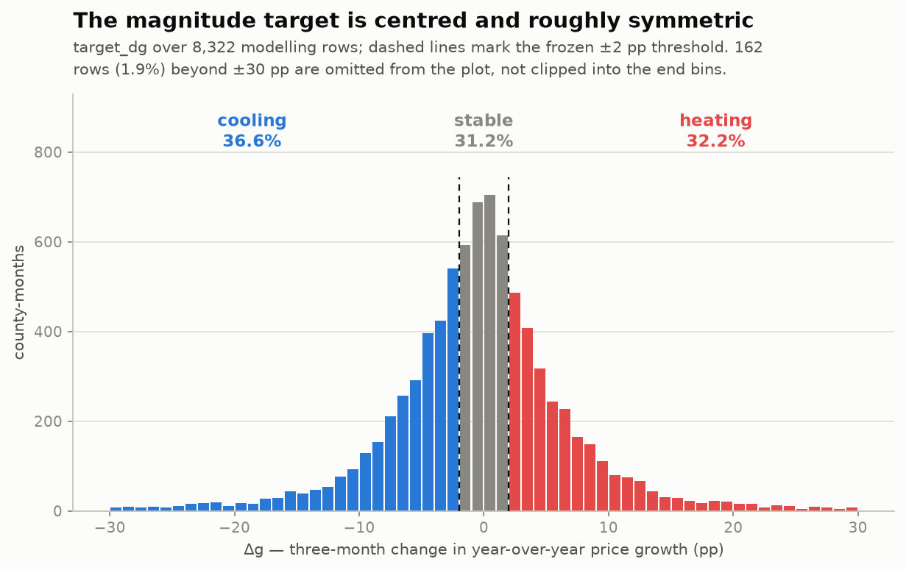
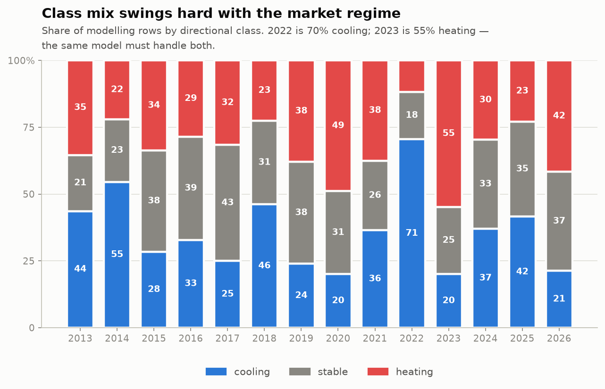
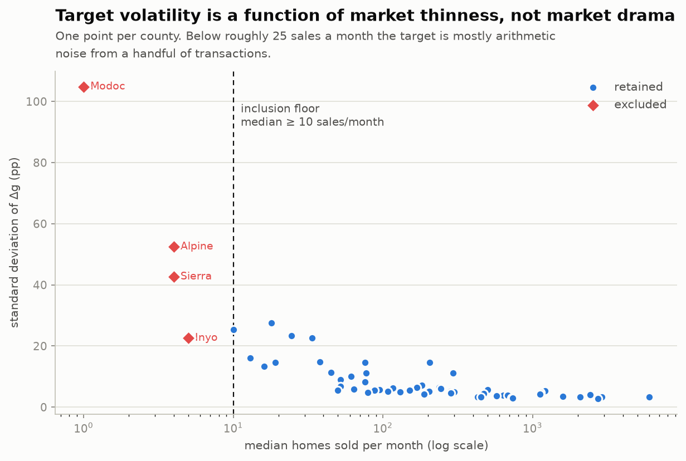
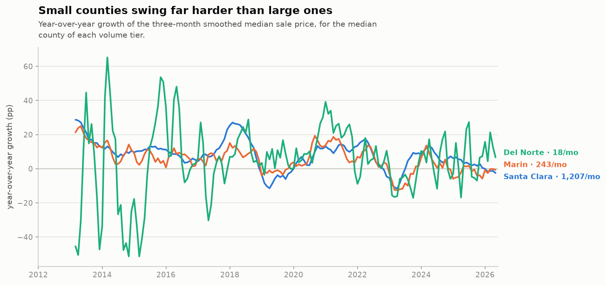
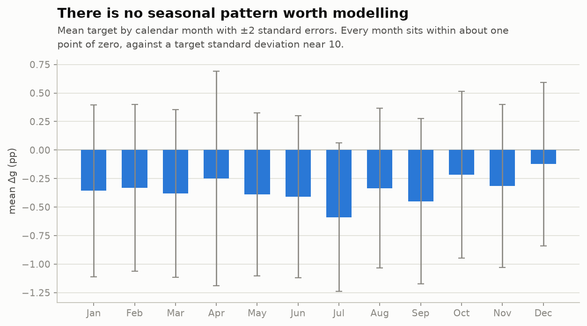

# Exploratory data analysis — target and panel

Generated 2026-08-09T00:01:17+00:00 by `chp eda`.
This file is regenerated by the pipeline; do not edit it by hand.
The interpretation of these numbers is in `docs/MILESTONE_2_EDA_MEMO.md`.

## The frozen target

- **Definition:** 3-month rolling mean of median_sale_price -> log 12-month growth -> 3-month change, tau = +/-2 pp, counties with median homes_sold < 10 excluded
- **Frozen:** 2026-08-09 (Milestone 2), see `configs/target.yaml`
- **Modelling rows:** 8,322 of 10,034 panel rows
- **Target window:** 2013-03 to 2026-02

## Continuous target distribution

- mean **-0.345 pp**, standard deviation **9.712 pp**
- median **-0.236 pp**, interquartile range **7.27 pp**
- median absolute change **3.64 pp**

| Quantile | 0.1% | 1.0% | 5.0% | 25.0% | 50.0% | 75.0% | 95.0% | 99.0% | 99.9% |
|---|---|---|---|---|---|---|---|---|---|
| Δg (pp) | -57.81 | -30.36 | -13.05 | -3.99 | -0.24 | +3.28 | +12.02 | +28.54 | +67.80 |

## Directional class prevalence

At the frozen threshold of ±2 pp: **cooling 36.6%**, **stable 31.2%**, **heating 32.2%**

### By year

| Year | cooling | stable | heating | rows |
|---|---|---|---|---|
| 2013 | 43.6% | 21.0% | 35.4% | 495 |
| 2014 | 54.6% | 23.4% | 22.0% | 610 |
| 2015 | 28.5% | 37.8% | 33.7% | 629 |
| 2016 | 32.9% | 38.6% | 28.5% | 648 |
| 2017 | 25.0% | 43.4% | 31.6% | 648 |
| 2018 | 46.1% | 31.3% | 22.5% | 648 |
| 2019 | 23.9% | 38.1% | 38.0% | 648 |
| 2020 | 20.1% | 31.0% | 48.9% | 648 |
| 2021 | 36.4% | 26.1% | 37.5% | 648 |
| 2022 | 70.5% | 17.7% | 11.7% | 648 |
| 2023 | 20.1% | 25.2% | 54.8% | 648 |
| 2024 | 37.0% | 33.3% | 29.6% | 648 |
| 2025 | 41.7% | 35.3% | 23.0% | 648 |
| 2026 | 21.3% | 37.0% | 41.7% | 108 |

### By county-volume tier

| Tier | cooling | stable | heating | counties | rows | dg_sd |
|---|---|---|---|---|---|---|
| thin | 43.9% | 9.1% | 47.0% | 6 | 889 | 20.55 |
| small | 40.1% | 23.6% | 36.3% | 14 | 2,172 | 10.74 |
| mid | 36.4% | 31.4% | 32.3% | 20 | 3,079 | 6.44 |
| large | 30.3% | 47.7% | 22.0% | 14 | 2,182 | 3.78 |

The `stable` band is not a constant fraction of the data: it shrinks as
counties get thinner, because thin-market noise alone exceeds the
±2 pp threshold. This is a property of the market, not of the model.

### Counties with the rarest classes

| County | cooling | stable | heating | smallest_class | dg_sd | volume |
|---|---|---|---|---|---|---|
| Del Norte County | 42.9% | 5.8% | 51.3% | 5.8% | 27.61 | 18.00 |
| Colusa County | 46.2% | 8.3% | 45.5% | 8.3% | 16.08 | 13.00 |
| Lassen County | 46.8% | 8.5% | 44.7% | 8.5% | 23.36 | 24.50 |
| Mariposa County | 42.9% | 9.0% | 48.1% | 9.0% | 14.66 | 19.00 |
| Glenn County | 42.3% | 9.6% | 48.1% | 9.6% | 13.41 | 16.00 |
| Mono County | 46.8% | 11.5% | 41.7% | 11.5% | 14.83 | 38.00 |
| Plumas County | 42.4% | 13.2% | 44.4% | 13.2% | 22.72 | 33.50 |
| Siskiyou County | 43.6% | 13.5% | 42.9% | 13.5% | 11.39 | 45.00 |
| Trinity County | 41.9% | 14.5% | 43.5% | 14.5% | 25.34 | 10.00 |
| Mendocino County | 44.9% | 15.4% | 39.7% | 15.4% | 10.15 | 61.00 |

## County inclusion rule

Counties whose median monthly `homes_sold` is below **10**
are excluded from modelling. Their rows remain in the panel, flagged by
`is_included`, so nothing is silently deleted.

### The excluded counties

| County | volume | rows | dg_sd | dg_abs_median | dg_max_abs |
|---|---|---|---|---|---|
| Modoc County | 1.00 | 17.00 | 104.82 | 86.36 | 208.56 |
| Alpine County | 4.00 | 130.00 | 52.47 | 30.07 | 188.34 |
| Sierra County | 4.00 | 121.00 | 42.66 | 26.86 | 153.13 |
| Inyo County | 5.00 | 137.00 | 22.61 | 17.20 | 61.05 |

### The retained counties, most volatile first

| County | volume | tier | rows | dg_sd | dg_max_abs |
|---|---|---|---|---|---|
| Del Norte County | 18.00 | thin | 156 | 27.61 | 112.54 |
| Trinity County | 10.00 | thin | 124 | 25.34 | 69.74 |
| Lassen County | 24.50 | thin | 141 | 23.36 | 102.74 |
| Plumas County | 33.50 | small | 144 | 22.72 | 111.11 |
| Colusa County | 13.00 | thin | 156 | 16.08 | 51.31 |
| Mono County | 38.00 | small | 156 | 14.83 | 57.99 |
| Mariposa County | 19.00 | thin | 156 | 14.66 | 44.86 |
| Imperial County | 76.00 | small | 156 | 14.64 | 63.55 |

## Coverage and missingness

### Lowest price coverage

| County | months | months_with_price | price_coverage | labelled_rows | included |
|---|---|---|---|---|---|
| Modoc County | 173 | 128 | 74.0% | 17 | False |
| Trinity County | 173 | 155 | 89.6% | 124 | True |
| Humboldt County | 173 | 157 | 90.8% | 128 | True |
| Stanislaus County | 173 | 160 | 92.5% | 143 | True |
| Lassen County | 173 | 166 | 96.0% | 141 | True |
| Alpine County | 173 | 168 | 97.1% | 130 | False |
| Sierra County | 173 | 169 | 97.7% | 121 | False |
| Inyo County | 173 | 171 | 98.8% | 137 | False |
| Plumas County | 173 | 172 | 99.4% | 144 | True |
| Riverside County | 173 | 172 | 99.4% | 155 | True |

### Column missingness

| Column | null_rate | nulls |
|---|---|---|
| price_drops | 23.9% | 2,400 |
| target_dg | 13.0% | 1,307 |
| growth_yoy | 10.5% | 1,058 |
| price_smoothed | 3.1% | 311 |
| median_dom | 3.0% | 306 |
| median_list_price | 2.5% | 255 |
| new_listings | 2.5% | 255 |
| off_market_in_two_weeks | 1.2% | 124 |
| pending_sales | 1.2% | 124 |
| months_of_supply | 1.2% | 118 |

### Extreme values against the declared plausible ranges

| Column | plausible_low | plausible_high | extreme_values | share | counties |
|---|---|---|---|---|---|
| median_dom | 0.00 | 365.00 | 97 | 1.0% | Alpine County, Plumas County, Modoc County |
| growth_yoy | -60.00 | 60.00 | 72 | 0.8% | Modoc County, Alpine County, Sierra County |
| target_dg | -60.00 | 60.00 | 68 | 0.8% | Alpine County, Sierra County, Modoc County |
| months_of_supply | 0.00 | 60.00 | 18 | 0.2% | Shasta County, Humboldt County, Plumas County |
| median_list_price | 20,000.00 | 10,000,000.00 | 7 | 0.1% | Alpine County, Lassen County |
| avg_sale_to_list | 0.70 | 1.50 | 7 | 0.1% | Modoc County, Humboldt County, Shasta County |
| unemployment_rate | 0.00 | 30.00 | 4 | 0.0% | Alpine County, Imperial County, Mono County |
| median_ppsf | 20.00 | 5,000.00 | 1 | 0.0% | Modoc County |

## Seasonality

`z` is the monthly mean divided by its standard error: how many standard
errors the month sits from zero.

| Month | mean | std | rows | stderr | z |
|---|---|---|---|---|---|
| Jan | -0.36 | 9.91 | 694 | 0.38 | -0.95 |
| Feb | -0.33 | 9.64 | 694 | 0.37 | -0.90 |
| Mar | -0.38 | 9.63 | 688 | 0.37 | -1.03 |
| Apr | -0.25 | 12.39 | 693 | 0.47 | -0.53 |
| May | -0.39 | 9.39 | 693 | 0.36 | -1.09 |
| Jun | -0.41 | 9.36 | 694 | 0.36 | -1.15 |
| Jul | -0.59 | 8.58 | 695 | 0.33 | -1.81 |
| Aug | -0.34 | 9.23 | 695 | 0.35 | -0.96 |
| Sep | -0.45 | 9.56 | 695 | 0.36 | -1.24 |
| Oct | -0.22 | 9.62 | 693 | 0.37 | -0.60 |
| Nov | -0.31 | 9.40 | 694 | 0.36 | -0.88 |
| Dec | -0.12 | 9.42 | 694 | 0.36 | -0.35 |

## Structural breaks

A descriptive scan: for each candidate month with 12 months either side,
the difference between the mean target after it and before it. This names
*when* the regime turned; it makes no claim about significance or cause.

| Month | mean_before | mean_after | shift |
|---|---|---|---|
| 2023-02-01 00:00:00 | -4.79 | 2.65 | 7.44 |
| 2021-05-01 00:00:00 | 4.11 | -2.80 | -6.90 |
| 2020-05-01 00:00:00 | 0.35 | 4.11 | 3.76 |
| 2015-01-01 00:00:00 | -2.81 | 0.21 | 3.02 |
| 2024-04-01 00:00:00 | 2.25 | -0.71 | -2.97 |

### Prevalence by mortgage-rate regime

| 30-year rate | cooling | stable | heating | rows | dg_mean |
|---|---|---|---|---|---|
| <4% | 28.4% | 34.0% | 37.7% | 3,580 | 0.55 |
| 4-5% | 45.4% | 30.2% | 24.4% | 2,258 | -1.51 |
| 5-6% | 76.4% | 13.4% | 10.2% | 216 | -4.85 |
| 6-7% | 39.1% | 30.1% | 30.8% | 1,998 | -0.51 |
| >7% | 20.4% | 26.3% | 53.3% | 270 | 2.27 |

---

Figures are written to `reports/figures/`. Findings, decisions and open
risks are recorded in `docs/MILESTONE_2_EDA_MEMO.md`.
