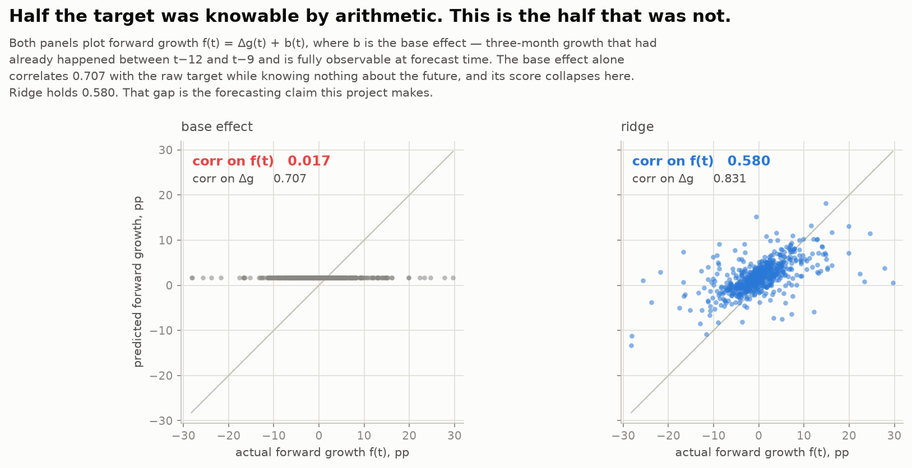
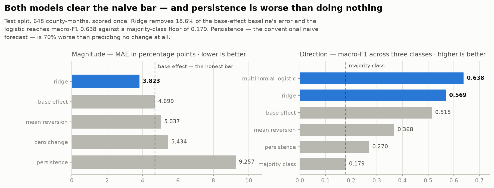
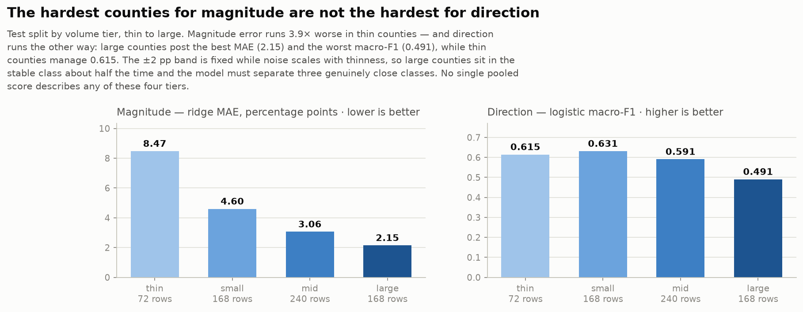
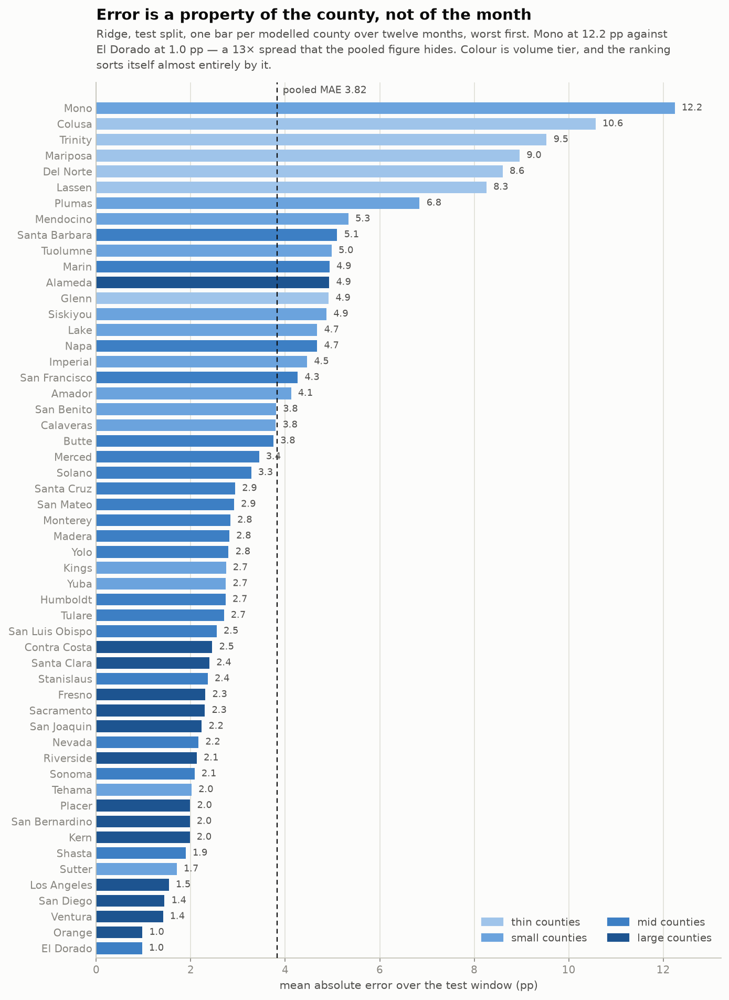

# Results — California Housing Pulse MVP

Generated by `chp report` from `data/processed/predictions.parquet`. Every number on this page is computed at render time; none is transcribed by hand.

Test split: **2025-03 → 2026-02**, 648 county-months across 54 counties, scored once after the pipeline was frozen.

## Read this first

The target decomposes exactly into `Δg(t) = f(t) − b(t)`, where `b` — the **base effect** — is three-month growth that already happened between `t−12` and `t−9` and is fully observable when the forecast is made. On the test window `corr(Δg, −b)` is **0.707**: roughly half this target was knowable in advance for reasons that have nothing to do with forecasting a housing market.

So the magnitude bar here is `base_effect`, not `zero_change`, and the skill measure is `corr on f(t)` — the correlation between predicted and actual *forward* growth. A model scored against zero-change is credited for arithmetic it did not perform.

## Results

| model | kind | MAE (pp) | vs base effect | vs zero change | macro-F1 | vs majority | corr on f(t) |
|---|---|---|---|---|---|---|---|
| persistence | naive | 9.257 | -97.0% | -70.3% | 0.270 | 0.091 | -0.157 |
| zero_change | naive | 5.434 | -15.6% | +0.0% | 0.178 | -0.001 | 0.108 |
| mean_reversion | naive | 5.037 | -7.2% | +7.3% | 0.368 | 0.189 | 0.208 |
| base_effect | naive | 4.699 | +0.0% | +13.5% | 0.515 | 0.336 | 0.017 |
| majority_class | naive | — | — | — | 0.179 | 0.000 | — |
| **ridge** | learned | 3.823 | +18.6% | +29.6% | 0.569 | 0.390 | 0.580 |
| **multinomial_logistic** | learned | — | — | — | 0.638 | 0.459 | — |

`vs base effect` and `vs zero change` are fractional MAE reductions; negative is worse than that baseline. `vs majority` is a difference in macro-F1, not a ratio. `corr on f(t)` is the honest skill measure — note that `base_effect` scores essentially zero on it, by construction, which is what makes it trustworthy.

## By volume tier — never pool these

| tier | rows | ridge MAE | ridge mean error | logistic accuracy | logistic macro-F1 |
|---|---|---|---|---|---|
| thin | 72 | 8.474 | 1.391 | 0.750 | 0.615 |
| small | 168 | 4.597 | 1.990 | 0.655 | 0.631 |
| mid | 240 | 3.060 | 1.901 | 0.583 | 0.591 |
| large | 168 | 2.147 | 1.841 | 0.655 | 0.491 |

Ridge's pooled macro-F1 of 0.569 describes no tier in this table.

## Uncertainty

| model | metric | block | point | 95% interval |
|---|---|---|---|---|
| ridge | mae | county | 3.823 | [3.230, 4.490] |
| ridge | mae | month | 3.823 | [3.571, 4.074] |
| multinomial_logistic | macro_f1 | county | 0.638 | [0.594, 0.681] |
| multinomial_logistic | macro_f1 | month | 0.638 | [0.599, 0.672] |
| base_effect | mae | county | 4.699 | [3.996, 5.488] |
| base_effect | mae | month | 4.699 | [4.344, 5.074] |

## Figures

Forward skill — the claim the project actually makes. Both panels plot `f(t)`, the part of the target that had not yet happened.

Magnitude and direction against every naive baseline, on the untouched test split.

The same results within volume tier. Magnitude and direction disagree about which counties are hard, which is why neither is quoted pooled.

Per-county magnitude error over the test window, worst first, coloured by tier.

## What this project can and cannot claim

**It can claim:**

- On one untouched twelve-month window (648 county-months, scored once), ridge predicted the magnitude of the three-month momentum change with MAE 3.823 pp against the honest naive bar's 4.699 pp — 18.6% less error.
- That skill is real forecasting rather than recovered arithmetic. On forward growth `f(t)`, the part that had not yet happened, ridge scores 0.580 where the base-effect baseline scores 0.017.
- Multinomial logistic separates heating, stable and cooling at macro-F1 0.638 against a majority-class floor of 0.179.
- Every feature was verified available at prediction time by three independent controls, one of which found and fixed a real leak in the unemployment lag.

**It cannot claim:**

- **That these numbers generalise across market regimes.** They come from one contiguous test window, 2025-03 to 2026-02, which leans cooling. Rolling-origin validation across regimes is the next milestone, and until it runs, a single held-out window is the honest description of the evidence.
- **Useful county-level accuracy in thin markets.** MAE is 8.47 pp in the thin tier against 2.15 pp in the large one. A forecast for Mono or Colusa carries error larger than most of the moves it is trying to call.
- **Calibrated probabilities.** The logistic emits class probabilities and they are scored, but no calibration was fitted and no reliability diagram has been drawn. That is Milestone 7.
- **Any causal statement.** These are predictive associations between observable market conditions and a later price-growth change. Nothing here identifies a mechanism, and nothing supports an intervention.
- **Symmetric performance across classes.** The models under-call cooling: mean error is positive in every quarter of the test window (+1.85 pp pooled), and cooling recall runs well below cooling precision. This is left uncorrected on purpose — tuning class weights after seeing the test set is what the frozen contracts exist to prevent.
- **That beating persistence means much.** Persistence is *worse than predicting no change at all* on this series, so clearing it is a low bar. The bar that counts is `base_effect`.
